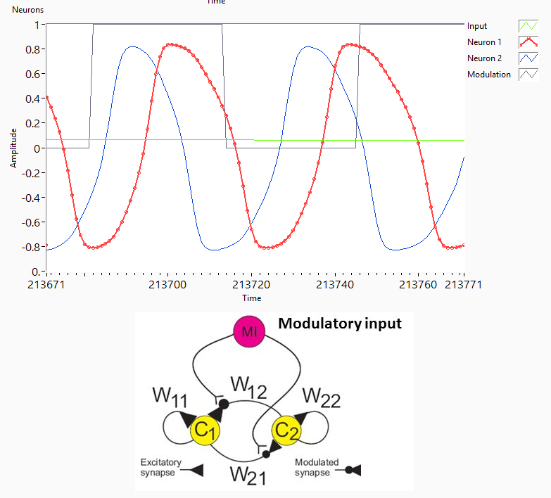

## Simulation of Area II velocity storage in the Goldfish BrainStem

#1. Central pattern generator modulated by Purkinje Cells. C1 and C2 correspond to vestibular cerebellar neurons in the goldfish flocculus.

